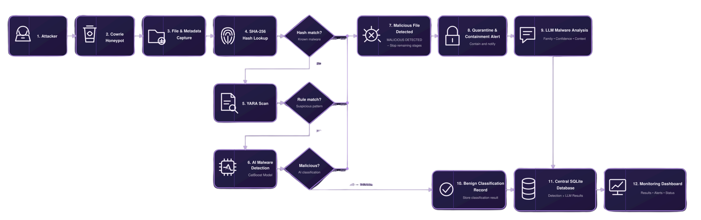
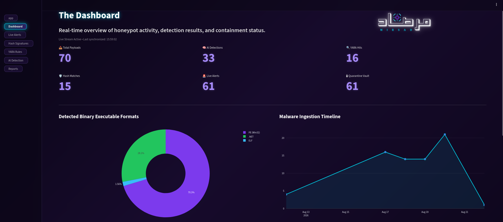
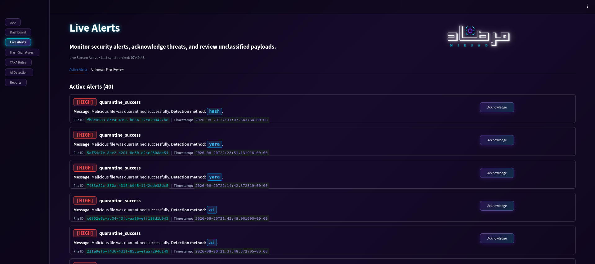
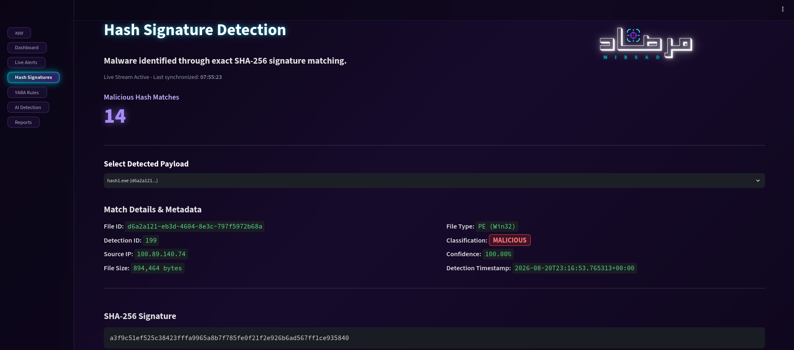
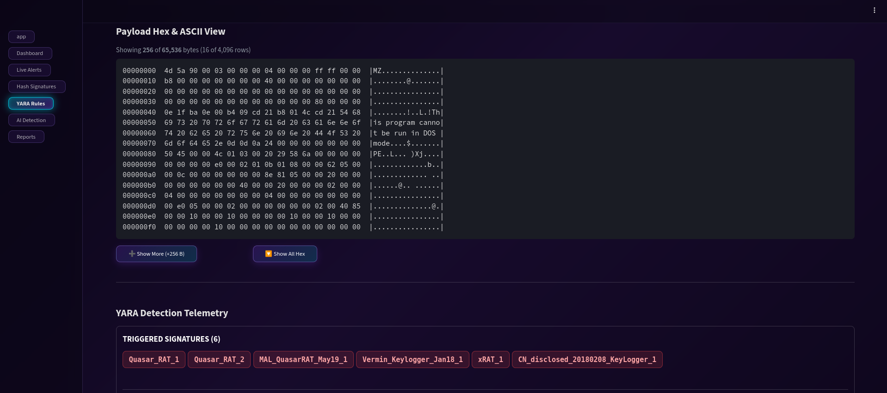
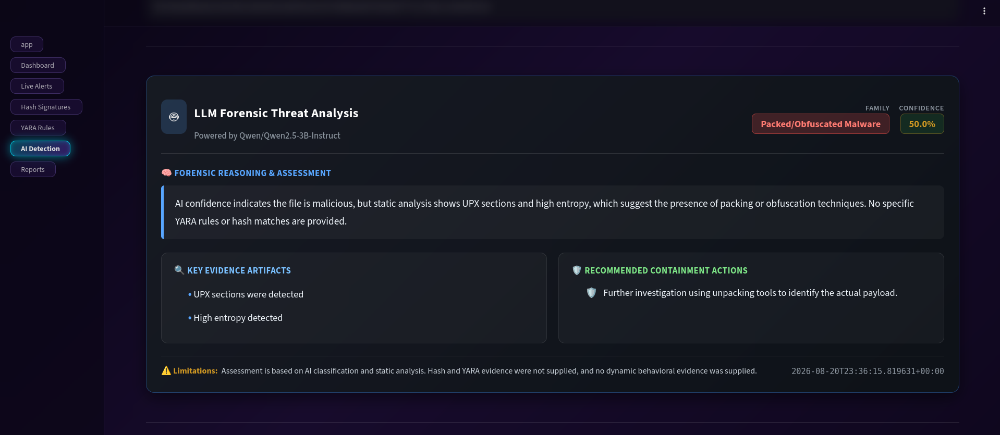
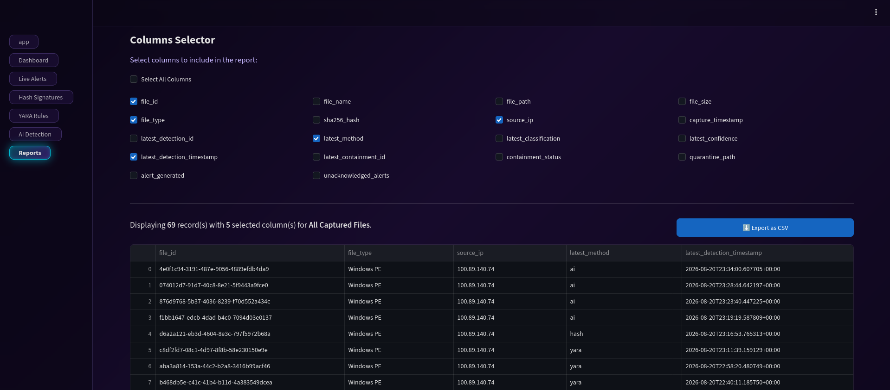

<p align="center">
  
  &nbsp;&nbsp;&nbsp;&nbsp;
  
</p>

<h1 align="center">AI-Powered Honeypot for Malware Detection at the Network Edge</h1>

<p align="center">
  <strong>MIRSAD (مِرصاد) — An Advanced Edge Security Framework for Real-Time Malware Detection, Analysis & Automated Containment</strong>
</p>

<p align="center">
  
  
  
  
  
  
  
</p>

---

## 📌 Overview

**MIRSAD (مِرصاد)** is an AI-powered edge security framework designed to capture, analyze, classify, and automatically contain malicious files at the network perimeter. 

The system utilizes an edge honeypot to intercept incoming files and analyze various malware variants through a multi-stage, cascading detection pipeline. This pipeline combines rapid SHA-256 threat intelligence lookups, pattern-based YARA signature scanning, and a CatBoost machine-learning model.

At the core of the AI detection layer, the system extracts **2,568 static features** from supported binary artifacts and evaluates them using a pre-trained CatBoost gradient-boosted classifier. Confirmed malicious artifacts are immediately moved into a dedicated quarantine environment with restrictive permissions to prevent execution. Simultaneously, all security events, detection results, and operational telemetry are recorded in a lightweight SQLite database.

To provide centralized oversight, a monitoring dashboard gives administrators full visibility into the malware detection and triage process, live alerts, and security events. Furthermore, a locally hosted LLM is integrated on the administrative side to provide deeper threat context, incident explanations, and malware family attribution.

**MIRSAD** is designed as a lightweight approach to malware defense at the network edge, seamlessly combining multi-stage detection, machine learning, LLM-assisted analysis, and automated quarantine.

---

## 🎯 Project Objectives

MIRSAD is designed around five primary objectives:

* **Capture:** Detect and collect malicious payloads directly at the network edge through a controlled honeypot environment.
* **Analyze:** Progressively analyze captured artifacts using fast signature-based methods followed by machine-learning inference.
* **Classify:** Identify malicious files using structural characteristics and static binary features.
* **Contain:** Automatically isolate confirmed malicious files to prevent further exposure or execution.
* **Visualize:** Provide security administrators with centralized, real-time monitoring and incident analysis capabilities.

---

## 🏗️ System Architecture

MIRSAD follows a **distributed edge-to-administration architecture**, separating resource-intensive workloads across two primary nodes. By offloading monitoring, detection, and automated containment to the **Edge Server** while handling centralized reporting and LLM-assisted analysis on the **Administrative Node**, the system ensures that the edge remains **lightweight, efficient, and responsive**.



---

## ⚙️ Core Detection Pipeline

MIRSAD uses a **sequential cascading detection strategy**. Each stage provides a different balance between detection speed, analytical depth, and computational cost.

### 1. SHA-256 Threat Intelligence Lookup

The first stage performs an immediate SHA-256 lookup against a local **MalwareBazaar-derived threat intelligence database**.

* Extremely fast identification of previously known samples.
* Avoids unnecessary processing when a known malicious hash is found.
* Provides an efficient first layer of defense.
* Stores the corresponding threat intelligence result for later investigation.

```text
Captured File
     │
     ▼
SHA-256 Calculation
     │
     ▼
Local Threat Intelligence Database
     │
 ┌───┴───────────┐
 │               │
Match           No Match
 │               │
 ▼               ▼
Malicious      Continue
```

---

### 2. YARA Signature Analysis

Files that are not identified by their SHA-256 hash are passed to the YARA detection layer.

The system uses a curated collection containing:

* **1,047 YARA rule files**.
* **6,542 rule declarations**.
* Rules sourced from collections including **Neo23x0** and **ReversingLabs**.

YARA provides pattern-based detection capable of identifying recognizable malware characteristics, code patterns, artifacts, and family-specific indicators.

```text
Unknown File
     │
     ▼
Compiled YARA Rules
     │
     ▼
Multi-Rule Scanning
     │
 ┌───┴───────────┐
 │               │
Match           No Match
 │               │
 ▼               ▼
Malicious      Continue
```

---

### 3. AI Malware Classification

Artifacts that remain unidentified after hash and YARA analysis are forwarded to the machine-learning layer. MIRSAD uses a pre-trained CatBoost gradient boosting classifier—trained offline using EMBER2024-compatible static features—to ensure lightweight on-device inference without heavy computational overhead at the network edge.
The pipeline analyzes 2,568 static features extracted from supported binary artifacts, allowing the model to identify structural characteristics associated with malicious software.
Key components include:
* Pre-trained offline CatBoost model weights to maintain lightweight edge performance
* EMBER2024 static feature extraction
* 2,568-dimensional feature representation
* Binary/static structural analysis
* Automated malware classification
* Confidence-based inference results

This stage provides an additional analytical layer for previously unknown or signature-unmatched artifacts, reducing reliance on traditional signature-only detection while keeping resource consumption minimal.

```text
Unknown Artifact
      │
      ▼
Static Feature Extraction
      │
      ▼
2,568 Features
      │
      ▼
EMBER2024-Compatible Representation
      │
      ▼
Pre-trained CatBoost Classifier
      │
 ┌────┴───────────┐
 │                │
Malicious       Benign
 │
 ▼
Containment
```

---

## 🛡️ Automated Containment

Once an artifact is confirmed as malicious, MIRSAD automatically activates its containment workflow.

The containment layer is responsible for:

* Moving malicious files into dedicated quarantine storage.
* Renaming quarantined artifacts using a `.quarantine` extension.
* Applying restrictive file permissions.
* Preventing accidental execution or further interaction.
* Generating security alerts.
* Recording detection results and operational events.
* Preserving relevant metadata for subsequent investigation.

The objective is to ensure that **detection is immediately followed by containment**, minimizing the time between identification and response.

---

## 🤖 LLM-Powered Threat Analysis

MIRSAD includes an administrative LLM analysis module hosted separately on the administrative side (decoupled from the resource-constrained edge node) designed to provide contextual interpretation of collected security evidence. 
The LLM layer operates strictly as an analysis and explanation component on the admin dashboard, running asynchronously in the background. This background processing ensures that the core containment and isolation workflows execute instantaneously without any processing delays, enabling rapid response and automated isolation at the network edge while deterministic detection decisions remain grounded in the SHA-256, YARA, and machine-learning layers.

It can assist administrators by interpreting:
* Detection results
* Malware classification
* YARA matches
* Attacker activity
* Session information
* File metadata
* Observed behavior
* Threat severity
* Incident context

By running independently in the background on the administration side, it prevents any heavy computational overhead on the edge honeypot while providing security analysts with a more accessible explanation of an event.

---

## 📊 Centralized Administration Dashboard

The **Streamlit Admin Dashboard** serves as the central control panel, communicating with the edge environment via the API layer to provide a unified view of the security infrastructure.

### Key Dashboard Capabilities

* **Real-Time Monitoring:** Tracks active events, pipeline status, and system activity.
* **Threat Visibility:** Analyzes severity distribution, malware classifications, and attacker data.
* **Live Alerts:** Manages security alert feeds, incident triage, and alert acknowledgments.
* **Hash Signatures:** Inspects SHA-256 matches, threat intelligence, and file metadata.
* **YARA Detection:** Reviews matched rules and signature results.
* **AI Detection:** Displays feature extraction metrics, CatBoost classifications, and confidence scores.
* **Reports:** Exports structured CSV incident records and forensic telemetry.
* **LLM Analysis:** Generates incident explanations and analyst-oriented threat summaries.

---

## 📸 Dashboard Preview

|                  1. Main Dashboard                  |                       2. Live Alerts                       |                            3. Hash Signatures                           |
| :-------------------------------------------------: | :--------------------------------------------------------: | :------------------------------------------------------------------: |
|                      |                                |                                         |
| *Real-time telemetry, KPIs, and detection overview* | *Live threat alerts, severity levels, and incident triage* | *Hash signature detection, database statistics, and payload metadata* |

|              4. YARA Detection              |                   5. AI Detection                 |                     6. Reports                     |
| :-----------------------------------------: | :---------------------------------------------------: | :------------------------------------------------: |
|              |                       |                            |
| *Binary HEX inspection and rule matching telemetry* | *Feature analysis and LLM threat insights* | *Incident reporting and forensic telemetry export* |

---

## 📁 Repository Structure

```text
AI-Powered-Honeypot-for-Malware-Detection/
│
├── Admin-Dashboard/                    # Centralized management & monitoring interface
│   ├── .streamlit/                     # Streamlit configuration settings
│   ├── config/                         # Dashboard themes, branding, and UI configuration
│   ├── data/                           # Local dashboard runtime data
│   ├── pages/                          # Modular Streamlit dashboard pages
│   │   ├── 1_Dashboard.py              # Main KPIs and monitoring overview
│   │   ├── 2_Live_Alerts.py            # Live alerts and incident triage
│   │   ├── 3_Hash_Signatures.py        # SHA-256 threat intelligence
│   │   ├── 4_YARA_Rules.py             # YARA detection results
│   │   ├── 5_AI_Detection.py           # AI classification and analysis
│   │   └── 6_Reports.py                # Incident reports and exports
│   ├── api_client.py                   # Client connector for edge API communication
│   ├── app.py                          # Main Streamlit application
│   ├── llm_analyzer.py                 # LLM-powered incident analysis
│   ├── receiver_api.py                 # Telemetry synchronization service
│   ├── requirements.txt                # Dashboard dependencies
│   └── start-dashboard.sh              # Dashboard startup script
│
├── Honeypot-Edge/                      # Edge honeypot and threat-containment node
│   ├── AI/                             # Machine-learning and feature extraction layer
│   │   ├── EMBER2024/                  # EMBER2024 feature extraction pipeline
│   │   ├── models/                     # Pre-trained CatBoost model weights
│   │   ├── elf_raw_features.py         # ELF static feature extraction
│   │   ├── evidence_extractor.py       # Forensic evidence extraction
│   │   └── predict.py                  # AI inference and classification
│   │
│   ├── rules/                          # Curated YARA rule collections
│   │
│   ├── storage_containment/            # Storage, database, alerts, and quarantine
│   │   ├── runtime/
│   │   │   └── database/
│   │   │       └── edge_detection.db   # Local SQLite database
│   │   ├── tests/                      # Detection and quarantine unit tests
│   │   ├── alerts.py                   # Security alert generation
│   │   ├── database.py                 # Database connection and session handling
│   │   ├── quarantine.py               # Automated file isolation
│   │   ├── repositories.py             # Database access layer
│   │   └── schema.sql                  # Relational database schema
│   │
│   ├── api.py                          # Edge telemetry API service
│   ├── config.py                       # Core edge configuration
│   ├── cowrie_connector.py             # Cowrie session and log parser
│   ├── cowrie_monitor.py               # Real-time honeypot activity monitor
│   ├── detector.py                     # Hybrid detection orchestrator
│   ├── file_repository.py              # Payload ingestion and validation
│   ├── hash_database.py                # MalwareBazaar hash lookup manager
│   ├── import_hashes.py                # Threat-intelligence database seeding
│   ├── requirements.txt                # Edge-node dependencies
│   ├── start-edge.sh                   # Edge startup script
│   ├── validate_yara_rules.py          # YARA syntax and compilation validator
│   └── yara_checker.py                 # YARA scanning engine
│
├── images/                             # Project logos and dashboard preview screenshots
│
├── .env.example                        # Environment variable template
├── .gitattributes                      # Git LFS configuration
└── .gitignore                          # Ignored files and directories
```

---

## 🛠️ Prerequisites

Before deploying MIRSAD, ensure your environment meets the following requirements distributed across the edge and administration nodes:

### 1. 🟠Honeypot Edge Node Requirements

**Operating System:** Linux (Ubuntu/Debian recommended, Kali Linux supported)

**Python:** 3.10+

**Package Manager & Environment:** pip and venv

**Shell:** Bash

**Honeypot:** Cowrie SSH/Telnet Honeypot

**Database:** SQLite

**AI Runtime:** CatBoost and required feature-extraction dependencies

**Detection Engine:** YARA


### 2. 🔵Admin Dashboard Node Requirements

**Operating System:** Linux (Ubuntu/Debian recommended, Kali Linux supported)

**Python:** 3.10+

**Package Manager & Environment:** pip and venv

**Shell:** Bash

**Dashboard Interface:** Streamlit

**LLM Integration:** API access/client libraries for contextual threat analysis

> [!NOTE]
> The administrative LLM analysis module requires internet connectivity and a valid API key (configured via environment variables) on the admin node.

---

## 🚀 Let's Start

### 1. Clone the Repository

```bash
git clone https://github.com/referefz/AI-Powered-Honeypot-for-Malware-Detection.git
cd AI-Powered-Honeypot-for-Malware-Detection
```

> [!IMPORTANT]
> Since MIRSAD uses a distributed architecture, you should separate and deploy the components across your target environments:
>
> 🟠Transfer the `Honeypot-Edge/` directory to your Edge Server (where Cowrie is running).
>
> 🔵Keep or transfer the `Admin-Dashboard/` directory on your Administrative Node.

---

### 2. 🟠Setup the Edge Server

Navigate to the edge deployment:

```bash
cd Honeypot-Edge
```

Create a local environment configuration from the provided template:

```bash
cp .env.example .env
```

Update the required values according to your deployment environment.

> [!NOTE]
> Never commit API keys, credentials, private endpoints, or other sensitive values to the repository.

Install the required dependencies:

```bash
python3 -m venv venv
source venv/bin/activate

pip install --upgrade pip
pip install -r requirements.txt
```

Make the startup script executable:

```bash
chmod +x start-edge.sh
```

Start the edge node:

```bash
./start-edge.sh
```

The edge node is responsible for:

* Monitoring Cowrie
* Collecting attacker activity
* Ingesting dropped files
* Running the detection pipeline
* Generating alerts
* Performing automated quarantine
* Storing telemetry

---

### 3. 🔵Setup the Admin Dashboard

Open a new terminal window on your administrative node and navigate to the dashboard directory:

```bash
cd Admin-Dashboard
```

Install dependencies:

```bash
pip install --upgrade pip
pip install -r requirements.txt
```

Make the dashboard startup script executable:

```bash
chmod +x start-dashboard.sh
```

Launch the dashboard:

```bash
streamlit run app.py
```

The dashboard will then be available through the local Streamlit interface.

The admin node is responsible for:
* Visualizing real-time telemetry and alerts from edge nodes
* Monitoring system health and container/service statuses
* Executing and providing contextual threat intelligence and analysis via the integrated LLM module
* Managing security incidents, logs, and automated quarantine records
  
---

## 📂 Data & Evidence Storage

MIRSAD secures and organizes all captured telemetry, metadata, cryptographic hashes (SHA-256), YARA matches, AI classifications, and quarantine statuses into a structured storage architecture. This reliable trail provides a solid foundation for incident investigation and forensic reporting.

For more details on database schemas and persistence, check out the [Storage and Containment Module README](Honeypot-Edge/storage_containment/README.md).

---

## 🧪 Testing & Validation

The project includes dedicated testing and validation components within the edge environment to ensure system reliability and rule accuracy.

### YARA Rule Validation

YARA detection rules can be validated before runtime execution by navigating to the edge directory and running:

```bash
cd Honeypot-Edge
python validate_yara_rules.py
```

### Component & Unit Testing

Core detection, database, and containment components can be tested using the unit tests located under:

```bash
Honeypot-Edge/storage_containment/tests/
```

---

## 🔐 Security Considerations

MIRSAD is designed to operate as a security monitoring and containment platform. Deployment should therefore follow appropriate isolation and hardening practices.

Recommended practices include:

* Run the honeypot in an isolated environment.
* Restrict administrative API access.
* Do not expose SQLite databases directly to untrusted networks.
* Protect environment variables and API credentials.
* Use restrictive permissions for quarantine storage.
* Keep YARA rules and threat-intelligence data updated.
* Run the edge node with the minimum privileges required.
* Separate the honeypot environment from production assets.
* Monitor administrative access and API activity.

---

## 🏆 Project Highlights

MIRSAD combines several defensive techniques into a single distributed security workflow:

**Edge Collection**
→ **Threat Intelligence**
→ **Signature Analysis**
→ **Machine Learning**
→ **Automated Containment**
→ **Centralized Monitoring**
→ **LLM-Assisted Analysis**

Rather than relying on a single detection mechanism, the system applies **multiple complementary layers**, allowing known threats to be identified rapidly while providing deeper analysis for artifacts that bypass traditional signatures.

---

## 🎓 Project & Acknowledgments

MIRSAD was developed as a **Capstone Project** for the **KAUST Academy** program.

**Institution:** King Abdullah University of Science and Technology (KAUST)

### Technologies & Resources

* **Honeypot Framework:** [Cowrie SSH/Telnet Honeypot](https://github.com/cowrie/cowrie)
* **Threat Intelligence:** [MalwareBazaar by abuse.ch](https://bazaar.abuse.ch/)
* **Machine Learning:** CatBoost
* **Malware Dataset / Features:** EMBER2024
* **Signature Detection:** YARA
* **Dashboard:** Streamlit
* **API Layer:** FastAPI
* **Database:** SQLite

---

## 📜 License

This project was developed for educational and research purposes as part of the **KAUST Academy International Summer School**.

Please review the licenses and usage terms of all third-party tools, datasets, YARA rule collections, and threat-intelligence resources included or referenced by the project.

---

<p align="center">
  <strong>MIRSAD — Detect. Analyze. Contain.</strong>
</p>

<p align="center">
  <i>AI-Powered Honeypot for Malware Detection at the Network Edge</i>
</p>
